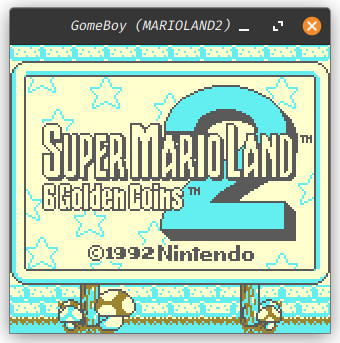

# gomeboy

GomeBoy is my attempt at creating a fairly accurate and reasonably performant Game Boy emulator written with golang. It 
is still currently in the very early stages of development, but it is already capable of running quite a few games with
varying degrees of success.

---

## Screenshots

### DMG Games

  

### DMG Games running on CGB hardware

  

### CGB Games

  

### Peripherals (Printer)

---

## Features

- GameBoy (DMG) and GameBoy Color (CGB) support
- SRAM and RTC support
- Run DMG games with CGB colorization palettes (without using a boot ROM)
- Automated testing against a large number of test ROMs
- Peripherals
	- Cartridge Mappers
      - MBC1	
      - MBC2
      - MBC3
      - MBC5
      - ROM
  - Cheat Carts
    - Game Genie
    - GameShark
  - Serial
    - Printer
    - Link Cable
    - Local Multiplayer (needs reimplementation)
- Platform-agnostic (runs on Windows, Linux, and Mac)

---

# Automated Test Results

| Test Suite | Pass Rate | Tests Passed | Tests Failed | Tests Total |
| --- | --- | --- | --- | --- |
| acid2 | 75% | 3 | 1 | 4 |
| bully | 0% | 0 | 1 | 1 |
| blarrg | 100% | 43 | 0 | 43 |
| little-things-gb | 100% | 4 | 0 | 4 |
| mooneye | 94% | 108 | 6 | 114 |
| samesuite | 46% | 6 | 7 | 13 |
| strikethrough | 0% | 0 | 2 | 2 |

Visit the [tests](tests/README.md) directory for more information.

---

# TODO

- [ ] build instructions
- [ ] github actions
- [ ] improve error handling and logging
- [ ] expose more emulator options to the user
- [ ] reimplement link cable & local multiplayer